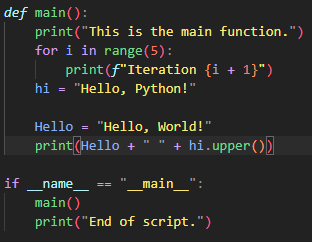

# team-pastel-colors README
Inspired by Monokai Pro spectrum filter
All colors are original
Built and tested only on Python

## For more information

* [Visual Studio Code's Markdown Support](http://code.visualstudio.com/docs/languages/markdown)
* [Markdown Syntax Reference](https://help.github.com/articles/markdown-basics/)

**Enjoy!**
